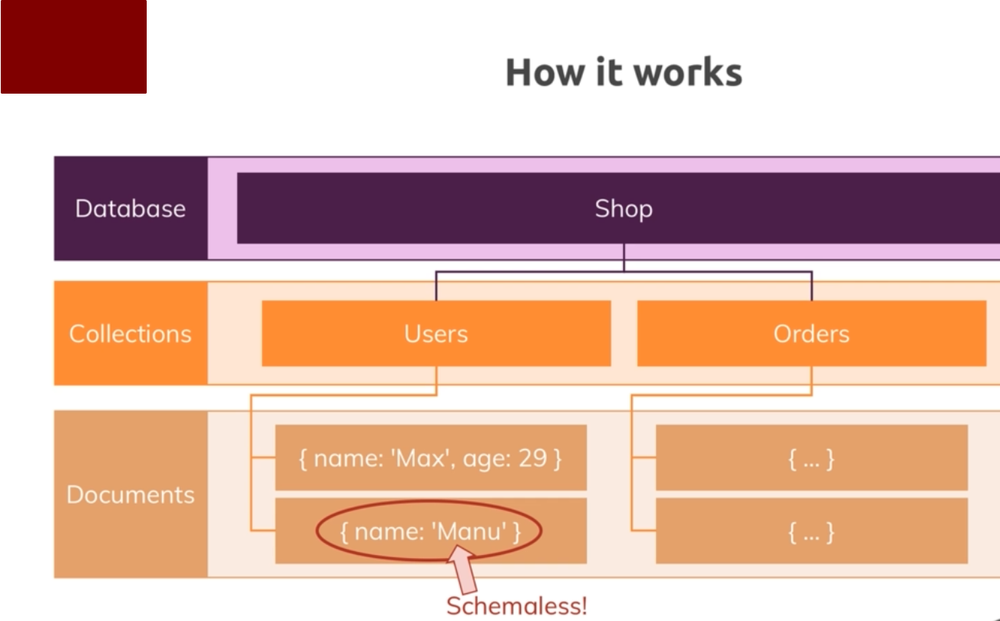
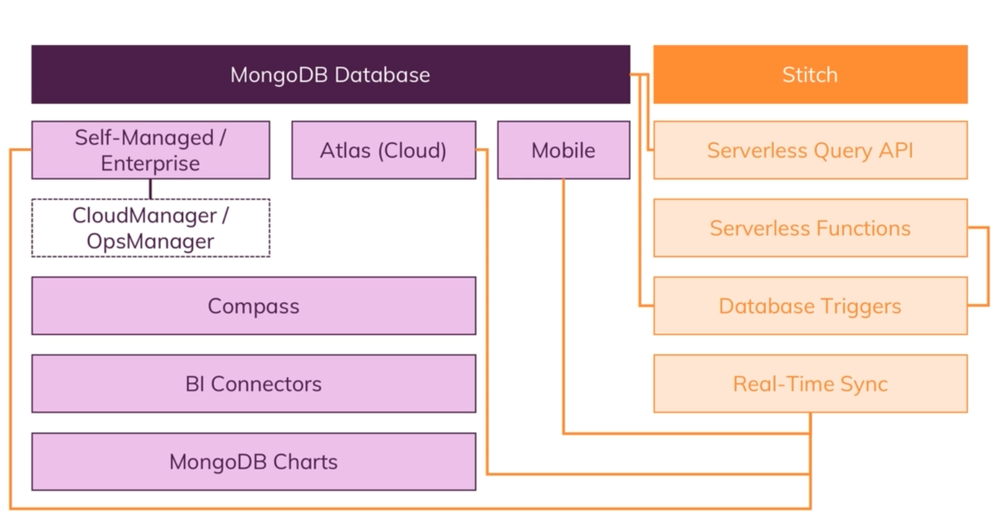
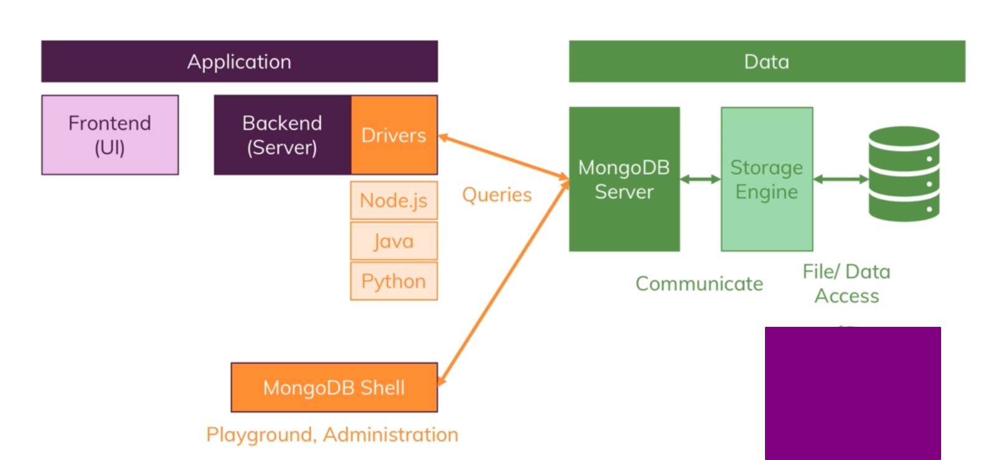
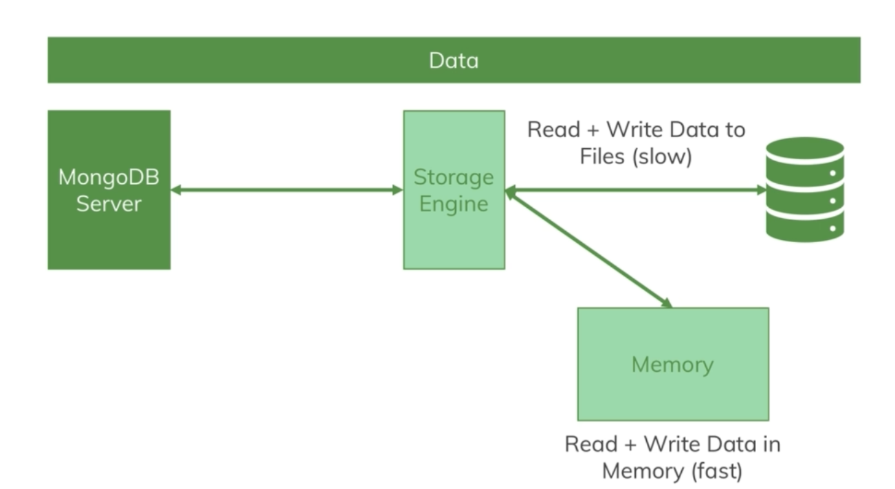
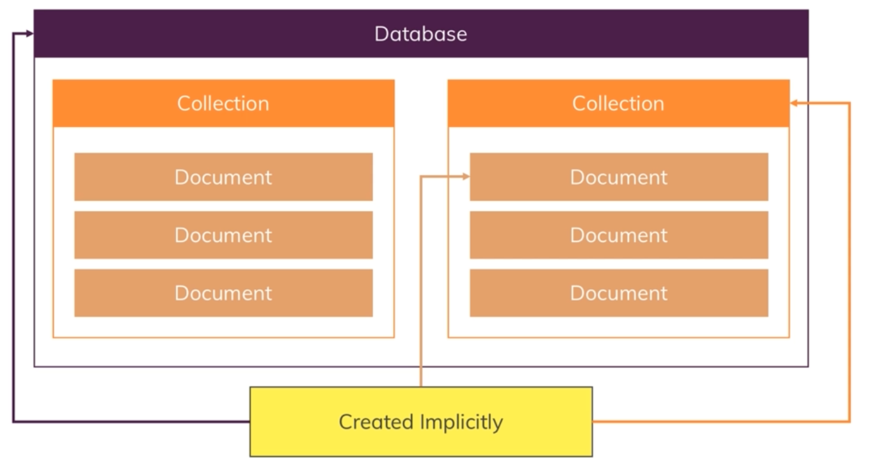

# INDEX

# MongoDB Course

### by Maximillian Academind (Udemy)

---

# Introducción

## Que es MongoDB

Es una base de datos preparada para almacenar multitud de datos y poder trajar con ellos de manera eficiente. Lo que lo diferencia del resto bbdd es que mongo es no relacional o no-SQL ddbb.

Mongo crea un entorno (servidor) donde almacenamos nuestras base de datos.
Por ejemplo creamos un base de datos "tienda" ésta en lugar de tablas almacena colecciones y dentro de estas tenemos documents que son datos escritos en JSON (JS object notation), su peculiaridad es que no siguen un esquema, de ahí la gran flexibilidad de mongoDB. Esta manera de almacenar datos evita tener que realizar los JOINS de SQL porque podemos almacenar juntos todos los datos que necesitemos.

En realidad cuando mongoDB guarda los datos lo hace como BSON(Binary object notation ) que esencialmente es una manera más eficiente que jSON.



## Carracterísticas de mongoDB

- No sigue un esquema
- Los datos se guardan todos juntos
- Por lo anterior se eliminan gran parte de las relaciones (JOINS) entre datos

## Ecosistema de mongoDB



## Instalación de mongoDB

Seguir los pasos:

[MongoDb - instalación](https://docs.mongodb.com/manual/tutorial/install-mongodb-on-ubuntu/)

Después de la instalación

```
sudo systemctl daemon-reload
```
y 
```
service mongod restart
```

Comprobar estado del servicio

```
sudo service mongod status
```
Entrar en mongo

```
mongo
```

Puede que tenga problemas al arrancar el servicio:

1. parar el servicio y volver a arrancar

```
service mongod stop
service mongod start
service mongod status

```
2. Unmask mongod
```
sudo systemctl unmask mongod
```
3. si no funciona
```
sudo chown -R mongodb:mongodb /var/lib/mongodb
sudo chown mongodb:mongodb /tmp/mongodb-27017.sock
```
4. si no funciona
```
- eliminar el directorio **/var/lib/mongodb**
- volver a crear el directorio **/var/lib/mongodb**
- darle permisos sudo **chmod -R 0777 /var/lib/mongodb**
```

- mongod
  - mongod es el "Mongo Daemon", es básicamente el proceso de host de la base de datos. Cuando inicia mongod, básicamente está diciendo "inicie el proceso de MongoDB y ejecútelo en segundo plano".
  
- mongo
  - mongo es el shell de la línea de comandos que se conecta a una instancia específica de mongod. Cuando ejecuta mongo sin parámetros, por defecto se conecta al localhost en el puerto 27017. 
    

## Cómo desinstalar mongo

```
sudo service mongod stop
```
```
sudo apt-get remove mongodb* --purge
```

```
sudo rm -r /var/log/mongodb
sudo rm -r /var/lib/mongodb
```

## configuración de mongo

El archivo de configuración de mongo se encuentra en la ruta `/etc/mongod.conf`.

```
# mongod.conf

# for documentation of all options, see:
#   http://docs.mongodb.org/manual/reference/configuration-options/

# Where and how to store data.
storage:
  dbPath: /var/lib/mongodb
  journal:
    enabled: true
#  engine:
#  mmapv1:
#  wiredTiger:

# where to write logging data.
systemLog:
  destination: file
  logAppend: true
  path: /var/log/mongodb/mongod.log

# network interfaces
net:
  port: 27017
  bindIp: 127.0.0.1


# how the process runs
processManagement:
  timeZoneInfo: /usr/share/zoneinfo

#security:

#operationProfiling:

#replication:

#sharding:

## Enterprise-Only Options:

#auditLog:

#snmp:
```

En este archivo tenemos dónde guardaremos nuestras bases de datos, el llamado `dbpath`

```
# Where and how to store data.
storage:
  dbPath: /var/lib/mongodb
```

si la queremos cambiar por otra ruta por ejemplo guardar los datos en nuestro directorio de usuario hacemos:

```
# Where and how to store data.
storage:
  dbPath: /home/david/data/db/
```
o tb lo podemos cambiar por comando  
```
mongod --dbpath "/home/david/data/db/"
```

Una vez cambiado tenemos que dar permisos a mongodb sobre ese directorio
```
sudo chown mongodb -R /home/david/data/db/

```
Reiniciar server o reiniciar pc
```
sudo service mongod restart
```


# Basics

## JSON vs BSON

Nosotros escribimos los datos usanando la notación JSON (JavaScript Object Notation) pero mongo transforma estos datos a BSON (Binary JSON). Es una mejor manera de almacenar datos, más eficiente.
 
## Drivers

Podemos usar drivers para conectar nuestra aplicación al servidor de mongoDB según el lenguaje que estemos utilizando (node, python,...) Pero las queries serán iguales que trabajar en el shell de mongoDB

[MongoDb - Drivers](https://docs.mongodb.com/drivers/)

## Cómo funciona mongoDB



1. tenemos una app con un lenguae de backend que mediante el uso de drivers conecta con el servidor de mongoDB
2. el servidor intercaciona con el motor de almacenaje, por defecto es el llamado **wired Tiger**
3. será este storage engine el que se encargará de encribir los datos en ficheros  
   1. El storage engine escribe los datos como último paso pero antes mantiene los datos en memoria para q su acceso sea más rápido
        

---

## Operaciones CRUD

En nuestro mongo server es donde tenemos nuestras bases de datos y cada una de ellas contiene uno o más colecciones(las tablas en sql) y éstas a su vez contienen los documentos que son los que relamente contienen la información.

Toda esta estructura se va creando de manera implícita a medida que vamos almacenando la información.



### Añadiendo datos

Cuando estamos en el shell de mongo podemos crear una nueva bbdd con el comando use nombreBBDD pero no se creará relamente hasta que no almacenemos datos.

Cuando insertamos datos

```js
db.flightsData.insertOne({
  "departureAirport": "MUC",
  "arrivalAirport": "SFO",
  "aircraft": "Airbus A380",
  "distance": 12000,
  "intercontinental": true   
}) 
```
mongo crea un id para cada documento, este ID es un objeto llamado ObjectId

```javascript 
"acknowledged" : true,
"insertedId" : ObjectId("60381afe739cc4092c54f411") 
```
para mostrar los datos

```javascript 
db.flightsData.find().pretty()

{
  "_id" : ObjectId("60381afe739cc4092c54f411"),
  "departureAirport" : "MUC",
  "arrivalAirport" : "SFO",
  "aircraft" : "Airbus A380",
  "distance" : 12000,
  "intercontinental" : true
}

```
Vemos com automáticamente se ha añadido un campo `_"id"`

Podemos generar nosotros ese id pero debemos seguir la sintaxi

```javascript 
db.flightsData.insertOne({
  "departureAirport": "MUC",
  "arrivalAirport": "SFO",
  _id: "miIdPersonalizado"
})
```
```javascript 
{
  "_id": ObjectId("60381afe739cc4092c54f411"),
  "departureAirport": "MUC",
  "arrivalAirport": "SFO",
  "aircraft": "Airbus A380",
  "distance": 12000,
  "intercontinental": true
},
{
  "_id": "miIdPersonalizado",
  "departureAirport": "MUC",
  "arrivalAirport": "SFO"
}
 
```
Vemos como no es necesario seguir el mismos esquema en los datos y como respera mi ID personalizado.


---
# Comandos importantes

Entrar en mongo shell
```
mongo
```
mostrar las bd
```js
show dbs
```
acceder a una de las bd o crearla si no existe
```js
use dbNAme
```
Una vez dentro crear una primera colección(products) e insertar un item
```js
db.products.insertOne( {name: "book", price:10.99 } )
```
Mostrar los datos
```js
db.products.find()
```
Mostrar los datos formatados
```javascript 
db.products.find().pretty() 
```